# Developer Guide

## Acknowledgements

- Java API documentation: https://docs.oracle.com/en/java/javase/17/docs/api/
- JUnit 5 User Guide: https://junit.org/junit5/docs/current/user-guide/
- AssertJ documentation: https://assertj.github.io/doc/

## Design & implementation

### Architecture overview

FitLogger follows a command-driven architecture. The main application loop reads one line of user input,
passes it to `Parser`, and executes the returned `Command` object polymorphically. Commands that modify
the workout data ask `Storage` to persist the updated state before reporting the result through `Ui`.

The architecture diagram below gives a high-level view of the main components before the later sections
zoom in on individual commands such as `edit`, `delete`, `search-date`, and `exit`.

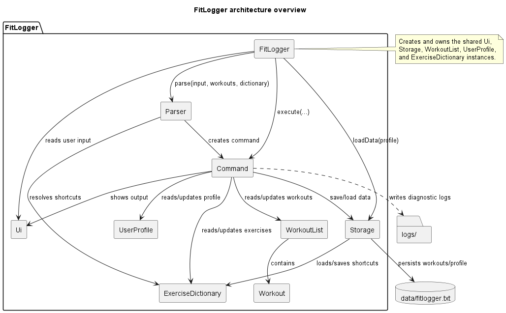

#### Implementation

The parsing logic is centralized in the `Parser#parse()` method. It follows a two-stage process:
1. **Tokenisation:** The input string is split into a `commandWord` and `arguments` using the `splitInput` helper method.
2. **Command Dispatch:** A `switch` block routes the `commandWord` to the appropriate command constructor or sub-parser method (e.g., `parseAddRun`).

The following sequence diagram illustrates the internal logic of the `Parser` when a user inputs an `add-run` or `delete` command:

#### Design Considerations

**Aspect: How the Parser is implemented**
* **Current Implementation:** Static utility class.
    * **Pros:** Simple to use across the application without maintaining state; no need to instantiate multiple parsers.
    * **Cons:** Harder to "mock" during unit testing compared to an instance-based approach.
* **Alternative Considered:** Instance-based Parser with Dependency Injection.
    * **Reason for Rejection:** Given the current scope of FitLogger, a static parser is more lightweight and sufficient for the required command set.

**Aspect: Data Validation**
* The parser ensures that no user-inputted text (like workout names) contains reserved characters (`|` or `/`) used by the `Storage` component. This prevents file corruption during save/load operations.
* Integer inputs such as workout indexes, shortcut IDs, sets, and reps are capped at 1,000,000 to avoid accepting unrealistic values or integer-overflow edge cases.
* Decimal workout values such as weight, distance, and duration are restricted to ordinary decimal notation. Inputs such as `NaN`, `Infinity`, or scientific notation (for example, `8e1`) are rejected before they can enter the workout model.
* Commands with fixed arity, such as `delete`, `search-date`, and `exit`, reject extra arguments so the parser does not silently ignore accidental input.

### Enhancement 1: `EditCommand`

#### Purpose and user value

`EditCommand` lets users modify an existing workout entry without deleting and recreating it.
This reduces friction when correcting common input mistakes (for example, wrong distance, duration,
sets, reps, weight, or name) while preserving the original workout ordering.

Supported fields:
- For all workouts: `name`
- For run workouts: `distance`, `duration`
- For strength workouts: `weight`, `sets`, `reps`

Command format:

```
edit <index> <field>/<value>
```

Examples:
- `edit 1 distance/4.67`
- `edit 2 reps/10`
- `edit 3 name/Tempo Run`

#### Design overview

At the architecture level, this enhancement follows FitLogger's existing command pipeline:

1. `Parser.parse(...)` receives raw user input.
2. `Parser.parseEdit(...)` validates format and extracts the index, field, and value.
3. `Parser` returns an `EditCommand` as a `Command`.
4. The runtime invokes `Command.execute(storage, workouts, ui, profile)` polymorphically.
5. `EditCommand` updates the selected `Workout` and reports the result through `Ui`.

Responsibilities remain clearly separated:
- Parser handles *syntax checking and tokenization*.
- Command handles *execution logic and field dispatch*.
- Workout classes enforce *domain invariants* through setter validation.

Internally, the shared text field in `Workout` is still stored as `description`, but it represents a
single user-facing workout name. `EditCommand` therefore documents `name` as the canonical field and
accepts `description` only as a backward-compatible alias.

#### UML diagrams

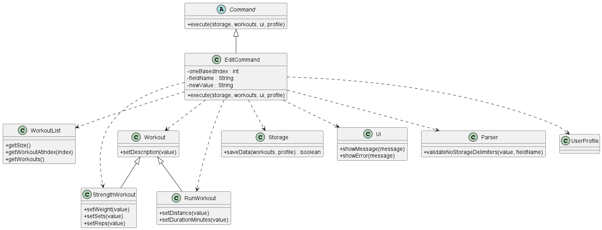

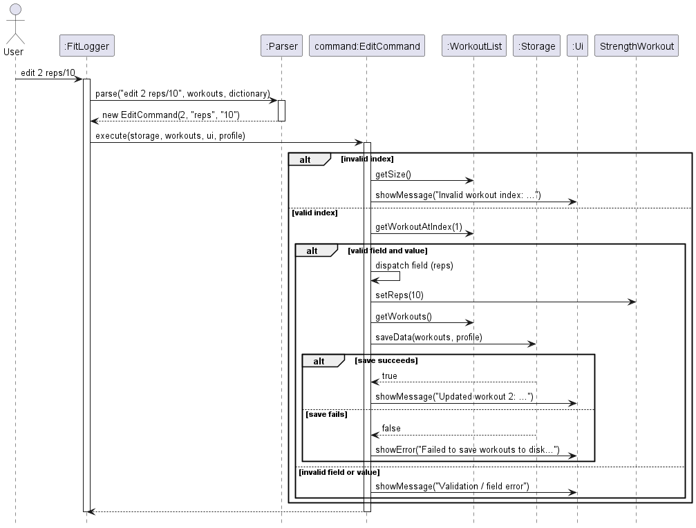

#### Component-level behavior

`EditCommand.execute(...)` performs the following steps:

1. Convert the user index from one-based to zero-based.
2. Validate bounds (`index >= 1 && index <= workouts.getSize()`).
3. Retrieve the target workout from `WorkoutList`.
4. Dispatch by field name using a switch statement.
5. Validate workout type compatibility for type-specific fields:
	- Reject `weight/sets/reps` for run workouts.
	- Reject `distance/duration` for strength workouts.
6. Parse numeric values for numeric fields.
7. Delegate final validation to domain setters.
8. Show a clear success or error message.

The command is intentionally defensive:
- Unknown fields are rejected (`Unknown editable field: ...`).
- Non-numeric numeric inputs are rejected.
- Invalid domain values are rejected via `FitLoggerException`.
- Save failure path is handled explicitly (error is shown, success message is not shown).
- Workout name edits are validated against reserved storage delimiters (`|` and `/`) to 
prevent save-file corruption.

#### Data integrity and validation decisions

Key safeguards:

- **Delimiter safety**: edited workout names are rejected when they contain reserved storage separators.
- **Finite numeric values**: `NaN` and `Infinity` are rejected for distance, duration, and weight.
- **Plain decimal notation**: scientific notation is rejected for editable distance, duration, and weight fields to keep behavior aligned with the User Guide examples.
- **Integer bounds**: edited sets and reps are capped at 1,000,000 to avoid overflow and unrealistic values.
- **Domain constraints**:
  - distance, duration > 0
  - weight >= 0
  - sets, reps > 0 and <= 1,000,000

These rules prevent invalid in-memory state and malformed persisted data.

#### Testing strategy

`EditCommandTest` covers both success and failure paths:

- Valid updates for run and strength workouts.
- Invalid index handling.
- Type mismatch handling (for example, lift-only fields on run workouts).
- Delimiter injection prevention for edited names.
- Rejection of non-finite numeric values (`NaN`, `Infinity`).
- Rejection of scientific notation and overlarge numeric values.

This verifies robust behavior under realistic user mistakes and malformed input.

#### Example usage scenario

Given below is an example scenario of how `EditCommand` is processed.

**Step 1.** The user enters an edit command, for example `edit 2 reps/10`.

**Step 2.** `Parser.parse(...)` routes the input to `Parser.parseEdit(...)`, which validates the command format and
extracts the index, field, and value.

**Step 3.** `Parser` returns an `EditCommand` object to the main execution loop.

**Step 4.** During `EditCommand.execute(storage, workouts, ui, profile)`, the command validates index bounds, checks field
compatibility with workout type, and parses/validates the new value.

**Step 5.** The target workout is updated through setter methods, and a success message is printed. If any validation
fails, an error message is shown instead.

---

### Enhancement 2: `DeleteCommand`

#### Purpose and user value

`DeleteCommand` allows users to remove workouts by index.
This keeps deletion aligned with the numbered workout list shown to users.

Supported formats:
- `delete <index>`

#### Design overview

The command is intentionally simple and cohesive:

1. Parser identifies the `delete` command and validates that exactly one positive one-based index was provided.
2. `DeleteCommand` stores the parsed index as command state.
3. During execution, the command checks only runtime concerns such as index bounds and persistence.
4. If the index is valid, the workout is removed from `WorkoutList`; otherwise, user sees validation feedback.

This design keeps parsing and command behavior focused while preserving compatibility with the existing pipeline.

#### UML diagrams

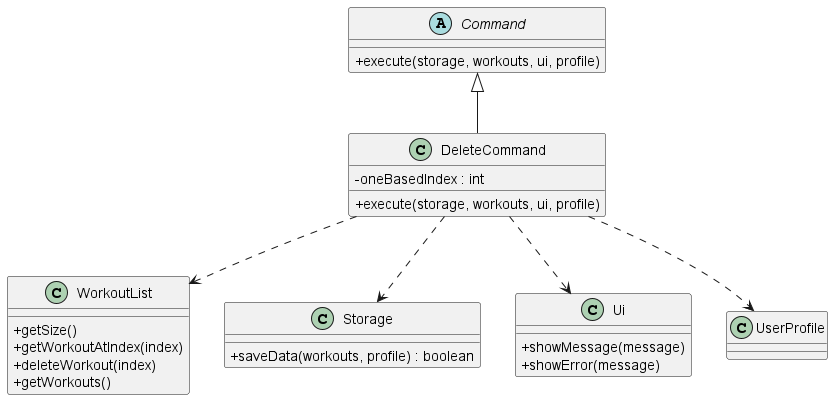

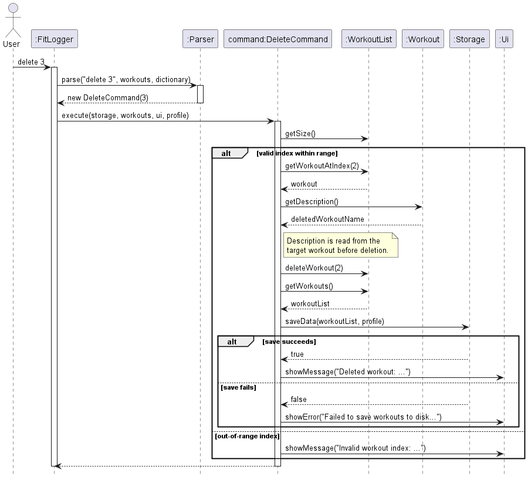

#### Component-level behavior

`DeleteCommand.execute(...)` performs:

1. Deletion:
  - Convert the one-based index to a zero-based list index.
  - If the zero-based index is out of range, show `Invalid workout index: <index>`.
  - Otherwise, delete the workout and show `Deleted workout: <name>`.

This approach avoids ambiguity and keeps deletion behavior predictable.

#### Edge cases handled

- Out-of-range indices larger than the current workout list size.
- Save failure after a successful in-memory deletion.

#### Testing strategy

`DeleteCommandTest` verifies:

- Index-based deletion success (one-based input behavior).
- Out-of-range index handling at execution time.
- Save is attempted only after a valid deletion.
- Save failure path shows an error and suppresses deletion success message.

`ParserTest` covers the syntax-level delete validation:

- Blank-input usage message.
- Rejection of non-numeric input.
- Rejection of extra indexes such as `delete 1 2`.
- Rejection of overflowing or overlarge indexes above 1,000,000.
- Rejection of zero as an invalid index.

This ensures the index-only deletion flow remains stable and regressions are caught early.

#### Example usage scenario

Given below is an example scenario of how `DeleteCommand` is processed.

**Step 1.** The user enters a delete command, for example `delete 3`.

**Step 2.** `Parser.parse(...)` identifies the `delete` command, validates the index, and creates a `DeleteCommand` with the parsed one-based index.

**Step 3.** In `DeleteCommand.execute(storage, workouts, ui, profile)`, the command converts the one-based index to zero-based form and checks bounds.

**Step 4.** If the index is valid and within range, the workout is removed from `WorkoutList` and the user sees a deletion confirmation.
Otherwise, the user sees an index validation message.

---

### Enhancement 3: `add-lift` Command and `StrengthWorkout`

#### Purpose and user value

The `add-lift` command allows users to log strength-based exercises directly from the CLI.
It captures four fields: exercise name, weight lifted in kilograms, number of sets, and
number of repetitions. This separates strength tracking from run tracking, giving users
a dedicated and validated logging path for gym workouts.

Command format:
```
add-lift <name> w/<weightKg> s/<sets> r/<reps>
```

Examples:
- `add-lift Bench Press w/80 s/3 r/8`
- `add-lift Squat w/100 s/5 r/5`
- `add-lift Pull-up w/0 s/3 r/10`

#### Design overview

This feature follows FitLogger's existing command pipeline:

1. `Parser.parse(...)` identifies the `add-lift` keyword and routes input to
   `Parser.parseAddLift(...)`.
2. `parseAddLift(...)` validates the input format, extracts the name and numeric fields,
   and constructs a `StrengthWorkout` object.
3. The `StrengthWorkout` is wrapped in an `AddWorkoutCommand` and returned to the main loop.
4. The main loop calls `Command.execute(storage, workouts, ui, profile)` polymorphically.
5. `AddWorkoutCommand` adds the workout to `WorkoutList`, saves it, and prints confirmation via `Ui`.

Responsibilities remain clearly separated:
- `Parser` handles syntax validation and tokenization.
- `AddWorkoutCommand` handles execution logic and list mutation.
- `StrengthWorkout` enforces domain invariants through setter validation.

#### Class-level design

The class diagram below shows the inheritance structure underpinning this feature.

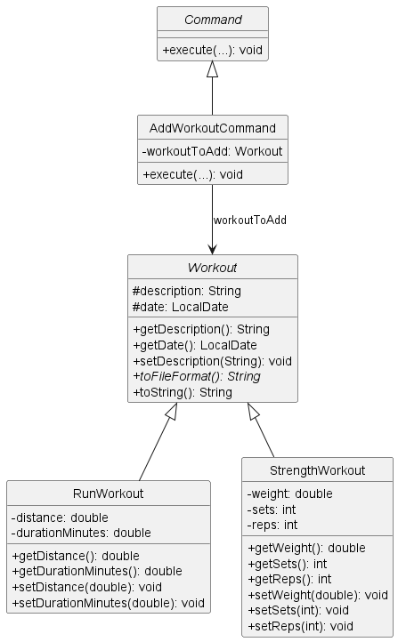

`StrengthWorkout` extends the abstract `Workout` base class, which also serves as the
parent for `RunWorkout`. This polymorphic design allows `WorkoutList` to store both types
under a single `ArrayList<Workout>` without needing separate lists. `AddWorkoutCommand`
holds a reference to the abstract `Workout` type, meaning the same command class handles
both `add-lift` and `add-run` — no separate `AddLiftCommand` class is needed.

#### Sequence of events

The sequence diagram below shows how a lift is logged when the user enters
`add-lift Bench w/80 s/3 r/8`.


The `StrengthWorkout` object is created inline during parsing and passed directly into
`AddWorkoutCommand`. The command does not store a reference to `Parser` or `Storage` —
it receives `storage` and `workouts` only at execution time via `execute(...)`, keeping
the command stateless until it runs.

#### Component-level behavior

`Parser.parseAddLift(...)` performs the following steps:

1. Check that arguments are not blank; throw `FitLoggerException` with usage hint if so.
2. Split the argument string on the `w/`, `s/`, and `r/` flag markers using
   `splitInput(arguments, "w/|s/|r/", 4)`.
3. Validate that exactly four parts were produced (name + three numeric fields).
4. Validate the exercise name against reserved storage delimiters (`|` and `/`).
5. Parse `weight` as a plain decimal, and `sets` and `reps` as bounded integers; throw on parse failure.
6. Apply domain constraints: weight >= 0, sets > 0, reps > 0, sets/reps <= 1,000,000.
7. Construct and return `new AddWorkoutCommand(new StrengthWorkout(...))`.

`AddWorkoutCommand.execute(...)` performs:

1. Call `workouts.addWorkout(workoutToAdd)`.
2. Persist using `storage.saveData(...)`.
3. On save failure, show an error and return.
4. On success, print confirmation via `ui.showMessage(...)` and `ui.printWorkout(...)`.

#### Storage format

A logged lift is persisted to `data/fitlogger.txt` in the following format:
```
L | <description> | <date> | <weight> | <sets> | <reps>
```

For example:
```
L | Bench Press | 2026-03-21 | 80.0 | 3 | 8
```

The `L` type prefix allows `Storage.loadData()` to distinguish lift entries from run
entries (`R`) when reconstructing the workout list on startup. Each field is pipe-separated
and positionally indexed, matching the index constants defined in `Storage`.

#### Editing a logged lift

After logging a lift, users can correct any field using `EditCommand`:
```
edit <index> weight/<value>
edit <index> sets/<value>
edit <index> reps/<value>
edit <index> name/<value>
```

`EditCommand` checks that the target workout is a `StrengthWorkout` instance before
applying weight, sets, or reps edits, and rejects those fields for run workouts. This
type-checking is done via `instanceof` in the dispatch switch. See Enhancement 1 for
the full `EditCommand` design.

#### Validation and error handling

| Input error | Error message shown |
|---|---|
| Missing arguments | `Missing arguments for add-lift.` + usage hint |
| Missing flag (e.g. no `r/`) | `Invalid format for add-lift.` + usage hint |
| Non-numeric weight/sets/reps | `Weight must be a decimal number; sets and reps must be integers.` |
| Scientific notation weight (e.g. `8e1`) | `Weight must be a decimal number; sets and reps must be integers.` |
| Negative weight | `Weight cannot be negative.` |
| Zero or negative sets | `Sets must be a positive integer.` |
| Zero or negative reps | `Reps must be a positive integer.` |
| Sets or reps above 1,000,000 | `Sets/Reps must not exceed 1000000.` |
| Name contains `\|` or `/` | `Exercise name must not contain '\|' or '/'` |

#### Design considerations

**Alternative 1 (current choice): Inheritance — `StrengthWorkout extends Workout`**

- Pros: Each subclass stores only the fields it needs. `WorkoutList` holds both types
  via polymorphism. `AddWorkoutCommand` is reused without modification. Adding a new
  workout type (e.g. cycling) only requires a new subclass.
- Cons: Type-specific operations in `EditCommand` require `instanceof` checks, which
  is a mild violation of the open-closed principle.

**Alternative 2: Single `Workout` class with all fields**

- Pros: Simpler class hierarchy, no casting needed.
- Cons: Every workout carries unused fields (e.g. a run entry storing `weight = 0`,
  `sets = 0`, `reps = 0`). This wastes memory and becomes harder to maintain as more
  workout types are added. Validation also becomes messier since the class cannot
  enforce which fields are required for which workout type.

Inheritance was chosen because it scales better as the app grows and keeps each class
focused on a single workout type.

---

### Enhancement 4: `RunWorkout`

#### Purpose and user value

`RunWorkout` represents a running workout entry in FitLogger. It extends the abstract 
`Workout` base class and adds two run-specific fields: distance (in kilometres) and 
duration (in minutes). This gives users a dedicated, validated data model for tracking
their runs separately from strength workouts.

Command format:

```
add-run <description> d/<distance> t/<durationMinutes>
```

Examples:

- `add-run Morning Jog d/5.0 t/30`
- `add-run Tempo Run d/10.5 t/55.5`

#### Design overview

`RunWorkout` sits at the data layer of FitLogger's architecture. It is constructed by `Parser.parseAddRun(...)` and 
passed into `AddWorkoutCommand`, following the same pipeline as `StrengthWorkout`:

1. `Parser.parse(...)` identifies the `add-run` keyword and routes input to `Parser.parseAddRun(...)`.
2. `parseAddRun(...)` validates the format, extracts the name and numeric fields, 
and constructs a `RunWorkout` object.
3. The `RunWorkout` is wrapped in an `AddWorkoutCommand` and returned to the main loop.
4. `AddWorkoutCommand.execute(...)` adds the workout to `WorkoutList` and confirms via `Ui`.

#### Class-level design
[See Diagram](#class-level-design)

`RunWorkout` extends the same abstract `Workout` base class as `StrengthWorkout`. 
This polymorphic design allows `WorkoutList` to store both types in a single `ArrayList<Workout>`. 
Domain validation is enforced directly in the setters, keeping invalid state from ever being stored.

The two run-specific fields and their constraints are:

|Field|Type|Constraint|
|---|---|---|
|`distance`|`double`|Must be finite and > 0|
|`durationMinutes`|`double`|Must be finite and > 0|

### Sequence of events
The sequence diagram below shows how a run is logged when the user enters `add-run Jog d/5 t/30`.
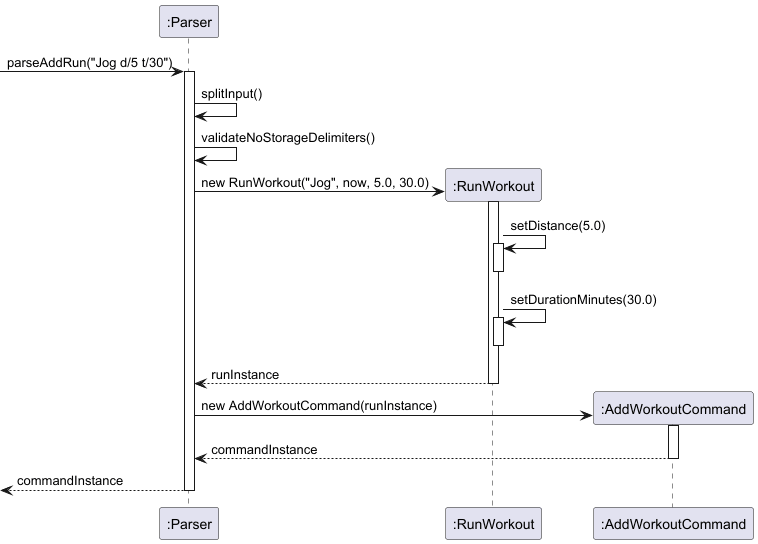
The `RunWorkout` object is created inline during parsing and passed directly into `AddWorkoutCommand`. 
The command does not store a reference to `Parser` or `Storage` — it receives `storage` and `workouts` only at 
execution time via `execute(...)`, keeping the command stateless until it runs.

#### Component-level behavior

The interaction between the `Parser` and the `RunWorkout` constructor is designed to be **fail-fast**. If the user provides a future date (during storage loading) or invalid metrics, a `FitLoggerException` is thrown immediately, preventing an invalid object from ever existing in the `WorkoutList`.

**Sequence of validation:**

1. **Tokenization:** `Parser` identifies the `d/` and `t/` flags.

2. **Format Validation:** `Parser` checks that the strings match a plain-decimal regex (rejecting `8e1`).

3. **Instance Creation:** The `RunWorkout` constructor is invoked.

4. **Domain Validation:** The constructor calls internal setters; if any field violates a constraint, construction fails.

#### Storage format

A logged run is persisted to `data/fitlogger.txt` in the following format:

```
R | <description> | <date> | <distanceKm> | <durationMinutes>
```

For example:

```
R | Morning Jog | 2026-03-27 | 5.0 | 30.0
```

The `R` type prefix allows `Storage.loadData()` to distinguish run entries from lift entries (`L`) when 
reconstructing the workout list on startup.

#### Validation and error handling

Validation is split between `Parser.parseAddRun(...)` (format-level) and `RunWorkout` setters (domain-level):

|Input error|Error message shown|
|---|---|
|Missing arguments|`Missing arguments for add-run.` + usage hint|
|Missing flag (e.g. no `d/`)|`Invalid format for add-run.` + usage hint|
|Non-numeric distance/duration|Parse error with usage hint|
|Scientific notation distance/duration|Parse error with usage hint|
|Zero or negative distance|`Distance must be a positive number.`|
|Zero or negative duration|`Duration must be a positive number.`|
|Non-finite value (`NaN`, `Infinity`)|Parse error with usage hint|

#### Design considerations

**Alternative 1 (current choice): Setters with validation in `RunWorkout`**

- Pros: Domain rules are enforced at the source. Invalid state cannot exist in a `RunWorkout` 
object at any point after construction. Setters are reused by `EditCommand` without duplicating validation logic.
- Cons: Checked exceptions from setters must be handled at every call site (constructor and `EditCommand`).

**Alternative 2: Validate only in `Parser`**

- Pros: Simpler class design with no exceptions thrown from setters.
- Cons: Validation logic is duplicated or bypassed if `RunWorkout` is ever constructed outside of `Parser`. 
This breaks encapsulation and makes the domain model unreliable.

Setter-level validation was chosen to ensure the domain model is always self-consistent, 
regardless of how it is constructed.

---

### Enhancement 5: `ViewShoeMileageCommand`

#### Purpose and user value

The `view-total-mileage` command provides hybrid athletes with an automated way to track equipment wear. By aggregating distance data from the `WorkoutList`, users can monitor "shoe mileage" to prevent injury and plan gear replacements. The command supports optional time-windowing to allow for "all-time," "today-only," or "past-X-days" analysis.

#### Command format

`view-total-mileage [DAYS]`

- `DAYS`: Optional non-negative integer (e.g., `0` for today, `30` for past month).

- If omitted, calculates all-time mileage.


**Sample Output:**

```
Total shoe mileage (past 7 day(s)): 15.50km across 3 run(s).
```

#### Design overview

The command follows the standard **Command Pattern**. It is instantiated by the `Parser` with a `daysLimit` state and executed polymorphically. It utilizes **Polymorphic Filtering** via `instanceof` to isolate `RunWorkout` data from the mixed-type `WorkoutList`.

#### UML diagrams

**Sequence Diagram: Execution and Filtering**

The following diagram illustrates how the command interacts with the `WorkoutList` and the `RunWorkout` objects to aggregate data.

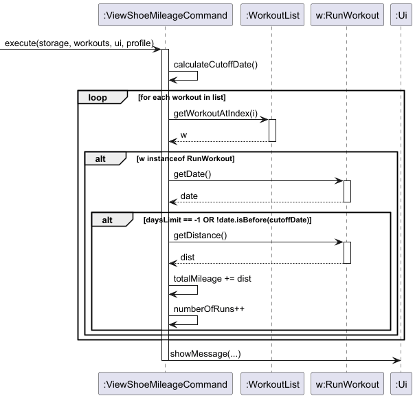

#### Component-level behavior

`ViewShoeMileageCommand.execute(...)` performs the following steps:

1. **Window Calculation**: Determines the `cutoffDate` (Today - `daysLimit`). If `daysLimit` is `-1`, the windowing logic is disabled.

2. **Aggregation**: Iterates through the `WorkoutList`. For every element:

    - It checks if the object is a `RunWorkout`.

    - It verifies the date is within the window (e.g., if `daysLimit` is `0`, only today's runs are counted).

    - It increments `totalMileage` and `numberOfRuns`.

3. **UI Feedback**: Dispatches the result to `Ui`.

    - Uses a specialized string for the `daysLimit == 0` case (Today).

    - Uses `String.format("%.2f", totalMileage)` to ensure decimal consistency.


#### Error handling

|**Input Scenario**|**Resulting Behavior**|
|---|---|
|Negative integer (e.g., `-5`)|`Parser` throws `FitLoggerException`: "Number of days must be a non-negative integer."|
|Non-numeric input (e.g., `abc`)|`Parser` throws `FitLoggerException` with usage hint.|
|Overlarge input (> 1,000,000)|`Parser` catches `NumberFormatException` and throws `FitLoggerException`.|
|No runs in list|Command succeeds and returns `0.00km across 0 run(s)`.|

#### Design considerations

**Aspect: Filtering Implementation**

- **Current Choice: Filtering via `instanceof` in Command.**

    - **Pros:** Keeps `WorkoutList` clean and type-agnostic. This makes the system easily extendable for other mileage types (e.g., cycling) without modifying the core data structure.

    - **Cons:** Coupling between the Command and `RunWorkout`.

- **Alternative: Type-specific sub-lists.**

    - **Reason for Rejection:** Maintaining separate lists for runs and lifts would double the `Storage` and `Parser` complexity. A single list with polymorphic filtering is more robust for a v2.1 CLI application.


**Aspect: Floating Point Representation**

- **Decision:** Distance is stored as a `double` but displayed as a formatted `String`.

- **Rationale:** Prevents the "Scientific Notation" bug. It ensures that $0.0001$ km doesn't display as $1.0E-4$, which would break the "non-technical" user experience.

---

### Enhancement 6: `ViewProfileCommand`, `UpdateProfileCommand`, and `ClearProfileCommand`

#### Purpose and user value

These commands give users a persistent identity within FitLogger by managing a `UserProfile` that stores their name, height, and weight.

- `ViewProfileCommand`: Displays the current profile with formatted placeholders for unset fields.

- `UpdateProfileCommand`: Facilitates partial updates, allowing users to modify a single field without affecting others.

- `ClearProfileCommand`: Resets all profile attributes to an "unset" state.


Command formats:

```
profile view
profile clear
profile set name <value>
profile set height <value>
profile set weight <value>
```

#### Design overview

The profile system utilizes a tiered inheritance model to categorize actions under a common parent, `ProfileCommand`, which extends the base `Command` class. This allows the application to handle all profile-related interactions through a unified execution interface.

The execution flow follows these steps:

1. `Parser.parse(...)` identifies the `profile` keyword and routes to sub-parsers.

2. For `profile set`, the `Parser` identifies the target field and provides the new value. Fields not provided are passed as sentinel values—`null` for strings and `-1.0` for numbers—to the `UpdateProfileCommand` constructor.

3. The returned command is executed polymorphically by the main loop.


#### Class-level design

The following class diagram shows the inheritance structure. By using `ProfileCommand` as an abstract bridge, we keep the main execution loop decoupled from the specific logic of viewing, clearing, or updating.
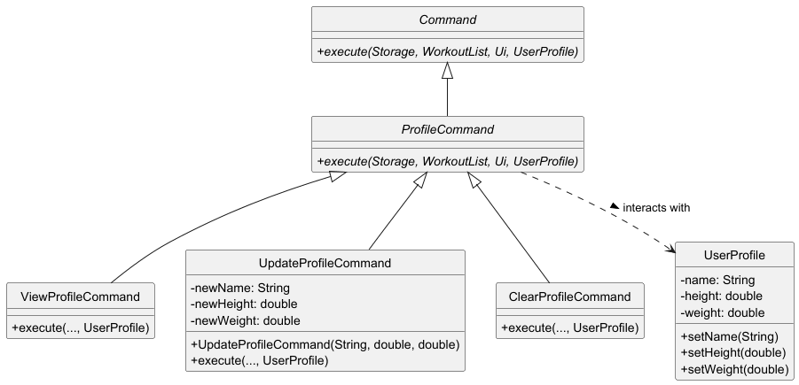

#### Sequence of events

The sequence diagram below illustrates a partial update where a user executes `profile set height 1.75`. It highlights the **Selective Invocation** logic where the command determines which `UserProfile` setters to trigger based on the presence of sentinel values.
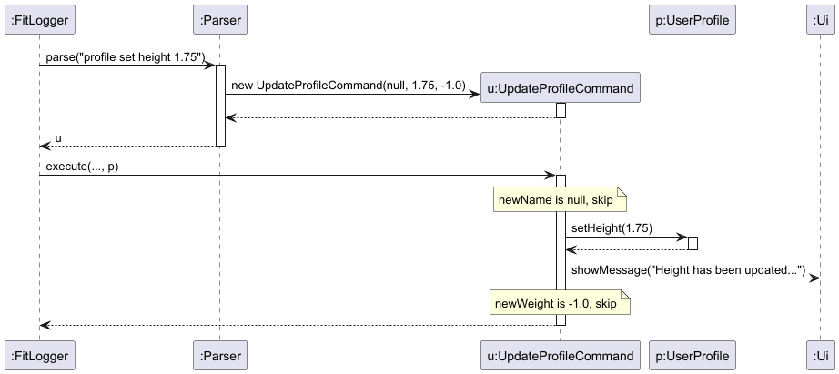
As shown in the diagram, the sequence within `UpdateProfileCommand#execute()` is as follows:

1. **Name Check**: The command evaluates `newName`. Since it is `null` (sentinel), the `setName` call is skipped.

2. **Height Update**: The command identifies `newHeight` as a valid update ($1.75$) and invokes `profile.setHeight(1.75)`.

3. **UI Feedback**: Immediately after the update, `ui.showMessage(...)` is called to confirm the specific change to the user.

4. **Weight Skip**: The command identifies `newWeight` as `-1.0` (sentinel) and skips the `setWeight` call, preserving existing data.


#### Component-level behavior

**`ViewProfileCommand.execute(...)`**

1. It opens a display block via the UI.

2. It performs a **Display Sentinel Check**:

    - If `getName()` is `null`, it displays "name not set yet".

    - If `getHeight()` or `getWeight()` is `-1.0`, it displays "height/weight not set yet".

3. Valid numerical values are formatted to 2 decimal places with their respective units (`m` or `kg`).


**`UpdateProfileCommand.execute(...)`**

1. If `newName != null`, it updates the name and sends a confirmation to the UI.

2. If `newHeight != -1.0`, it updates the height and sends a confirmation to the UI.

3. If `newWeight != -1.0`, it updates the weight and sends a confirmation to the UI.


**`ClearProfileCommand.execute(...)`**

1. It resets the `UserProfile` by passing `null`, `-1.0`, and `-1.0` to the respective setters.

2. It notifies the user that the profile has been successfully cleared.


#### Sentinel value design decision

`-1.0` is used as a numeric sentinel because it is outside the valid physical domain for height and weight. This allows the system to clearly distinguish between a "reset" or "no-change" state and an actual measurement of `0`.

The `UpdateProfileCommand` constructor enforces this boundary via assertions:

Java

```
assert newHeight == -1 || newHeight >= 0 : "Height is invalid";
assert newWeight == -1 || newWeight >= 0 : "Weight is invalid";
```

#### Validation and error handling

|**Input error**|**Error message shown**|
|---|---|
|Height outside $[0.3, 3.0]$|`Your Height/Weight is unrealistically low/high.`|
|Weight outside $[10, 500]$|`Your Height/Weight is unrealistically low/high.`|
|Non-numeric input|`Please provide a valid number for height/weight`|
|Scientific notation|`Please provide a valid number for height/weight`|

#### Design considerations

**Aspect: Implementation of updates**

- **Current choice: Separate Commands for View/Update/Clear**

    - **Pros**: Adheres to the Single Responsibility Principle. `UpdateProfileCommand` handles only the logic of state change, while `ViewProfileCommand` is a pure read operation.

    - **Cons**: Increases the number of classes in the command package.

---

### Enhancement 7: Exercise Shortcut System (`ExerciseDictionary`, `AddShortcutCommand`, `DeleteShortcutCommand`, and `ViewDatabaseCommand`)

#### Purpose and user value

The exercise shortcut system lets users log workouts by typing a short numeric ID instead of the full exercise name every time. For example, `add-lift 2 w/80 s/3 r/8` resolves to `Bench Press` via the database, avoiding repetitive typing.

The system has four parts:
- `ExerciseDictionary`: the in-memory data model storing ID-to-name mappings for lifts and runs.
- `AddShortcutCommand`: lets users extend the database with their own shortcuts at runtime.
- `DeleteShortcutCommand`: lets users cleanly remove custom shortcuts and their associated metadata.
- `ViewDatabaseCommand`: lets users see what shortcuts are currently available.

The database ships with four default lift shortcuts and three default run shortcuts. Custom shortcuts added via `add-shortcut` are permanently persisted to the save file alongside the user's profile and workout history.

#### Class-level design

The class diagram below shows the relationships between the components.

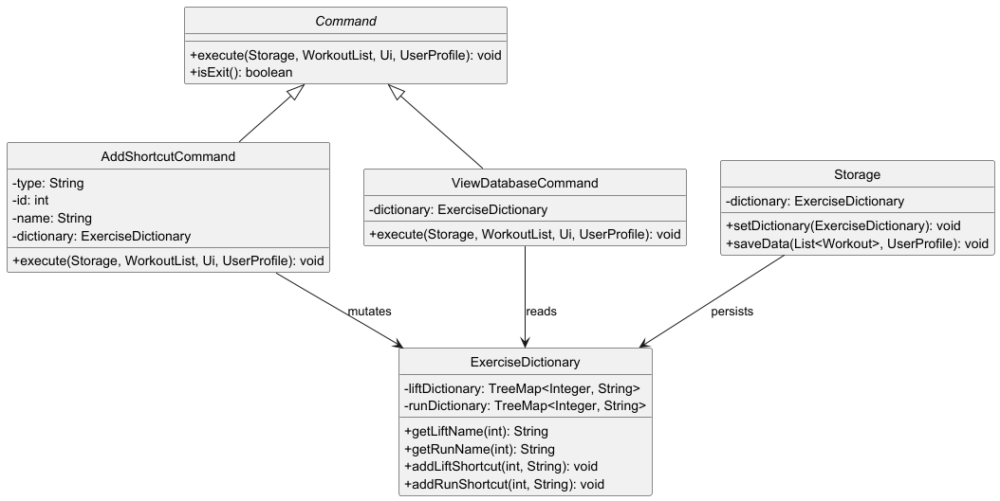

`ExerciseDictionary` is the shared data model. `AddShortcutCommand` mutates it; `ViewDatabaseCommand` reads from it. Both extend the abstract `Command` base class, keeping them consistent with the rest of FitLogger's command pipeline.

`ExerciseDictionary` uses two `TreeMap<Integer, String>` fields; one for lifts, one for runs. `TreeMap` was chosen over `HashMap` so entries are always displayed in ascending ID order by `ViewDatabaseCommand`.

#### Object-level design (Memory Snapshot)

The object diagram below illustrates a snapshot of the `ExerciseDictionary` in memory after a user has launched the app (loading the default exercises like Squat and Easy Run) and added a custom shortcut via `add-shortcut lift 99 Muscle Up`.

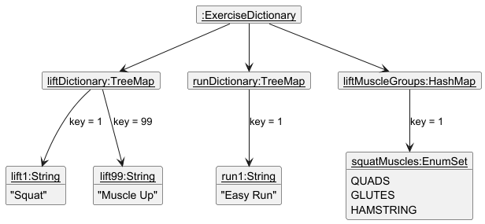

This snapshot demonstrates how the three internal maps manage their data:
- `liftDictionary` and `runDictionary` map integer IDs to their respective exercise name strings.
- `liftMuscleGroups` maps the same lift ID to an `EnumSet` of `MuscleGroup` tags.

#### Component-level behavior

**`ExerciseDictionary`** exposes:

- `getLiftName(int id)` / `getRunName(int id)`: returns the name for a given ID, or `null` if not found.
- `addLiftShortcut(int id, String name)`: inserts or overwrites an entry. To prevent dangling metadata, overwriting an ID automatically calls `liftMuscleGroups.remove(id)` to wipe old tags.
- `removeLiftShortcut(int id)` / `removeRunShortcut(int id)`: deletes the entry from the database and wipes any associated muscle tags.
- `getLiftShortcuts()` / `getRunShortcuts()`: returns the full map, used by `Ui.showExerciseDatabase(...)`.

**`Parser.parseAddShortcut(...)`** performs:

1. Split arguments into three parts: `type`, `id`, and `name` using `splitInput(arguments, " ", 3)`.
2. Validate `type` is `"lift"` or `"run"`.
3. Parse `id` as a positive integer.
4. Validate `name` against reserved storage delimiters (`|` and `/`).
5. Return `new AddShortcutCommand(type, id, name, dictionary)`.

**`AddShortcutCommand.execute(...)`** performs:

1. Call `dictionary.addLiftShortcut(id, name)` or `dictionary.addRunShortcut(id, name)` based on `type`.
2. Display a confirmation via `Ui`.

**`Parser.parseDeleteShortcut(...)`** performs:

1. Splits arguments into two parts: `type` and `id`.
2. Validates `type` is exactly `"lift"` or `"run"`.
3. Parses `id` as a positive integer within application limits.
4. Returns `new DeleteShortcutCommand(type, id, dictionary)`.

**`DeleteShortcutCommand.execute(...)`** performs:

1. Checks if the `id` exists in the corresponding lift or run dictionary. Throws a `FitLoggerException` if not found.
2. Retrieves the exercise name for the success message.
3. Calls `dictionary.removeLiftShortcut(id)` or `dictionary.removeRunShortcut(id)` based on `type`.
4. Displays a confirmation message via `Ui`.

The sequence diagram below shows this flow for `add-shortcut lift 5 Romanian Deadlift`.

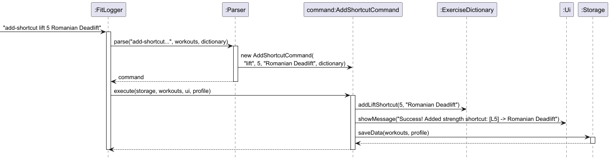

#### Shortcut resolution in `add-lift` and `add-run`

Using a shortcut ID in `add-lift` (e.g. `add-lift 2 w/80 s/3 r/8`) triggers a resolution step inside `Parser.parseAddLift(...)` before the `StrengthWorkout` is created. The sequence diagram below shows this flow.

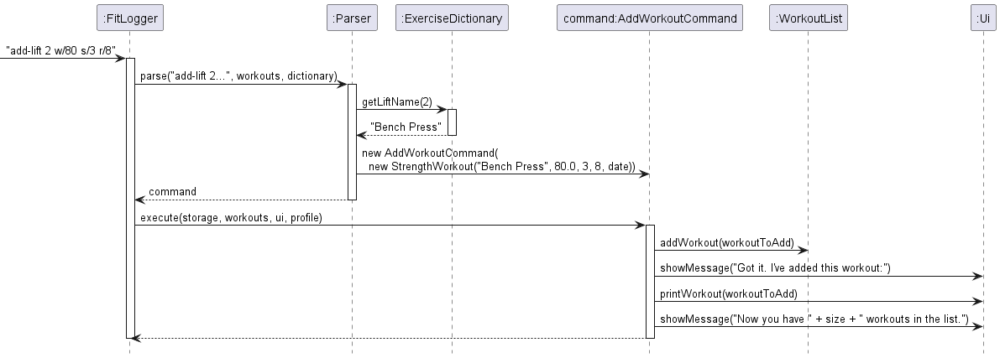

The resolution logic first checks whether the name token contains only digits:
- If it does, the token is parsed using `parsePositiveIntegerWithinLimit(...)` and resolved through the relevant dictionary. A `null` return means the ID does not exist, and a `FitLoggerException` is thrown pointing the user to `view-database`.
- If it does not, the token is treated as a plain-text name and used as-is.

This means numeric IDs and full names are both accepted with no special flag needed, and the resolution is entirely a parsing concern — `StrengthWorkout` and `AddWorkoutCommand` are unchanged.

#### Validation and error handling

| Input error | Error message shown |
|---|---|
| Missing arguments | `Missing arguments.` + usage hint |
| Fewer than 3 parts | `Invalid format.` + usage hint |
| Type not `lift` or `run` | `Shortcut type must be 'lift' or 'run'.` |
| Non-numeric ID | `Shortcut ID must be a positive integer.` |
| ID <= 0 | `Shortcut ID must be a positive integer.` |
| ID above 1,000,000 | `Shortcut ID must not exceed 1000000.` |
| Name contains `\|` or `/` | `Shortcut name must not contain '\|' or '/'` |
| ID not found in database | `Shortcut ID [n] does not exist. Type 'view-database' to see available shortcuts.` |

#### Design considerations

**Aspect: Where to mutate the dictionary**

- **Current choice: mutate in `AddShortcutCommand.execute(...)`**: Consistent with all other commands. Parsing is side-effect-free; state changes only happen at execution time. This makes `Parser` easier to test in isolation.
- **Alternative: mutate in `Parser.parseAddShortcut(...)`**: Fewer classes, but parsing would have observable side effects. This breaks the separation of concerns and makes unit testing harder.

**Aspect: Dictionary persistence**

- **Current choice: persist shortcuts to the save file using a dedicated row format (`S | <type> | <id> | <name>`)**: Custom shortcuts survive app restarts, giving users a permanent, personalized database. By injecting the dictionary into Storage via setter injection, we bypassed the need to modify the base Command signature, preserving the existing architecture.
- **Alternative: in-memory only, rebuilt from defaults on launch**: Simple and predictable. The database state is always known at startup.

---

### Enhancement 8: `search-date` Command

#### Purpose and user value

`search-date` lets users quickly filter workouts done on a specific date.
This avoids manual scanning of the entire history when checking day-level consistency.

Command format:
```
search-date <YYYY-MM-DD>
```

#### Design overview

1. `Parser.parse(...)` dispatches `search-date` to `parseSearchDate(...)`.
2. `parseSearchDate(...)` validates date presence and format (`LocalDate.parse`).
3. A `SearchDateCommand` is returned and executed polymorphically.
4. `SearchDateCommand.execute(...)` scans `WorkoutList` and collects matching dates.
5. If matches exist, `Ui.showWorkoutList(...)` prints them under a dated heading.
6. If there are no matches, the command prints only `No workouts found.`.

#### UML diagrams

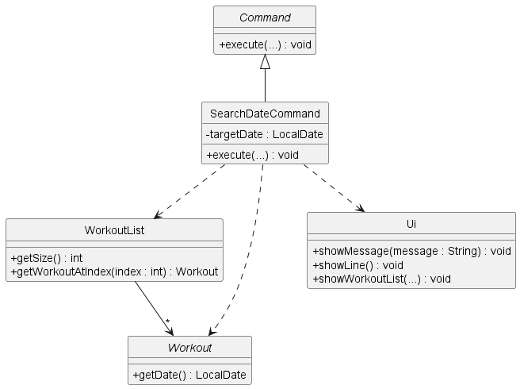

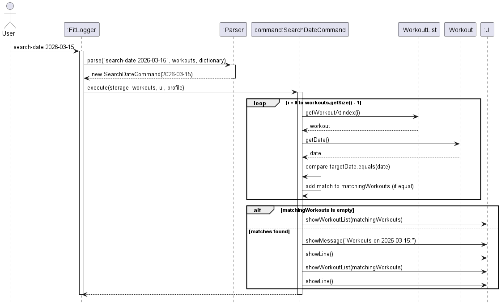

#### Validation and edge cases

- Missing date throws `FitLoggerException` with usage hint.
- Invalid date format throws `FitLoggerException` with usage hint.
- Extra arguments after the date throw `FitLoggerException` with usage hint.
- Empty result set is handled cleanly in UI.

---

### Enhancement 9: Save Failure Handling in Commands

#### Purpose and user value

This enhancement prevents silent save failures by making persistence outcomes explicit.
If save fails, the app now shows clear error messages instead of always implying success.

#### Design overview

1. `Storage.saveData(...)` returns `boolean` (`true` for success, `false` on `IOException`).
2. `AddWorkoutCommand`, `DeleteCommand`, `EditCommand`, and `ExitCommand` check that result.
3. On failure, commands show `ui.showError(...)` and skip success-only messages.

#### UML diagrams

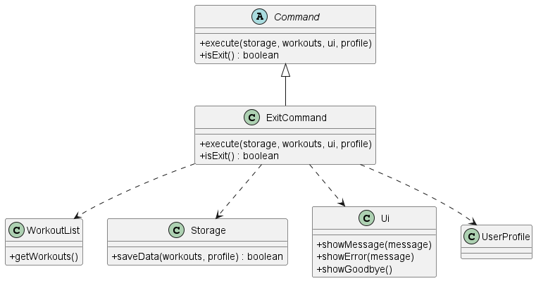

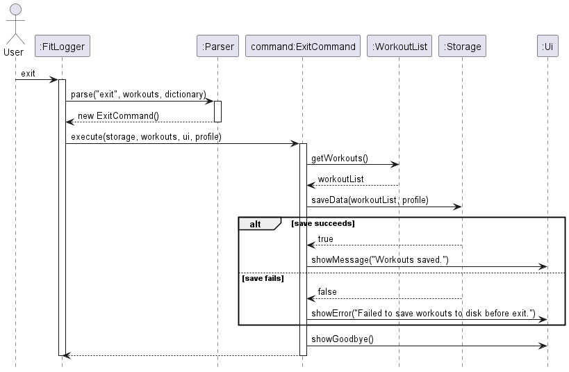

---

### Logging Design

#### Purpose and user value

FitLogger records command-level diagnostic information for troubleshooting without cluttering the command-line interface. This keeps normal command output readable while still preserving useful execution details for developers.

#### Design overview

1. `LoggingConfig.configure()` removes the default console handlers from the root Java logger.
2. It registers a `FileHandler` that appends log entries to `logs/fitlogger.log`.
3. `FitLogger` configures logging during normal startup.
4. `Command` also configures logging in a static initializer so command tests and direct command construction use the same non-console logging behavior.

If the log file cannot be created, logging is disabled instead of printing log records into the user-facing terminal.

This logging configuration applies to messages emitted through Java's `Logger` API, such as command execution diagnostics. `Storage` owns its own save-file recovery behavior and may still print user-visible warnings when it skips corrupted lines or encounters file-system problems during persistence.

---

### Enhancement 10: `Storage` — `saveData()` and `loadData()`

#### Purpose and user value
`Storage` persists workout data between sessions. `saveData()` writes all workouts
to disk on exit so no data is lost. `loadData()` reconstructs the workout list on
startup so users resume exactly where they left off.

#### Design overview

At the architecture level, `Storage` sits between the command layer and the file system:

1. `ExitCommand.execute(...)` calls `storage.saveData(workouts, profile)` on exit.
2. `FitLogger()` constructor calls `storage.loadData(profile)` on startup.
3. Both methods operate on `data/fitlogger.txt`, creating the `data/` directory
   automatically if it does not exist.

#### saveData() — Sequence of events

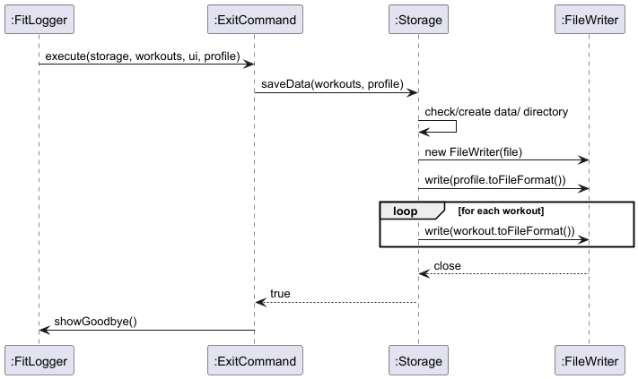

`saveData()` performs the following steps:

1. Assert that the workout list is not null.
2. Check if the `data/` directory exists — create it via `mkdirs()` if not.
3. Open a `FileWriter` on `data/fitlogger.txt`.
4. Write the user profile as the first line using `profile.toFileFormat()`.
5. Loop through each `Workout` and write `workout.toFileFormat()` on its own line.
6. Close the writer automatically via try-with-resources.
7. Print an error message if an `IOException` occurs.

#### loadData() — Sequence of events

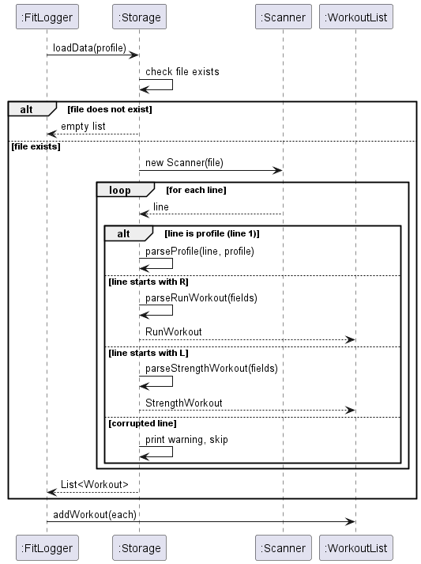

`loadData()` performs the following steps:

1. Check if `data/fitlogger.txt` exists — return an empty list silently if not
   (expected on first run).
2. Open a `Scanner` on the file.
3. Read line 1 as the user profile via `parseProfile(line, profile)`.
4. For each subsequent line:
    - Skip blank lines.
    - Split on `|` to extract fields.
    - Dispatch by type prefix: `R` → `parseRunWorkout(fields)`,
      `L` → `parseStrengthWorkout(fields)`.
    - On corrupted lines, print a warning and skip.
5. Return the reconstructed `List<Workout>`.

#### Storage file format
```
name: John height: 1.75 weight: 70.0
R | Morning Jog | 2026-03-21 | 5.0 | 30.0
L | Bench Press | 2026-03-21 | 80.0 | 3 | 8
```

Line 1 is always the user profile. Each subsequent line is one workout entry,
prefixed by `R` (run) or `L` (lift).

#### Design considerations

**Aspect: File format**
- **Current choice: pipe-separated plain text**
    - Pros: Human-readable, easy to debug manually, no external libraries needed.
    - Cons: Reserved characters (`|`, `/`) must be blocked from user input to
      prevent corruption. This is enforced in `Parser.validateNoStorageDelimiters(...)`.
- **Alternative: JSON or CSV**
    - Pros: Well-supported parsing libraries available.
    - Cons: Adds external dependencies and complexity for a CLI app of this scope.

**Aspect: Handling corrupted lines**
- **Current choice: skip and warn** — corrupted lines print a warning and are
  skipped, allowing valid entries below to still load.
- **Alternative: abort on first error** — simpler but loses all valid data
  below the corrupted line.

---

### Enhancement 11: `ViewLastLiftCommand`

#### Purpose and user value
`ViewLastLiftCommand` lets users instantly retrieve the most recent stats for a
specific lift exercise without scrolling through their full history. This is
useful before a gym session to check the last weight, sets, and reps logged.

Command format:
```
lastlift <EXERCISE_NAME>
```

Example: `lastlift Bench Press`

#### Class-level design

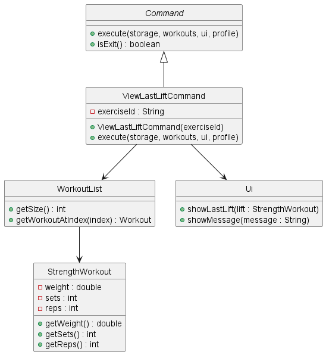

`ViewLastLiftCommand` extends the abstract `Command` base class and holds the
target `exerciseId` as its only state. It depends on `WorkoutList` to search
through entries and `Ui` to display results. It does not modify any state —
it is a pure read operation.

#### Sequence of events

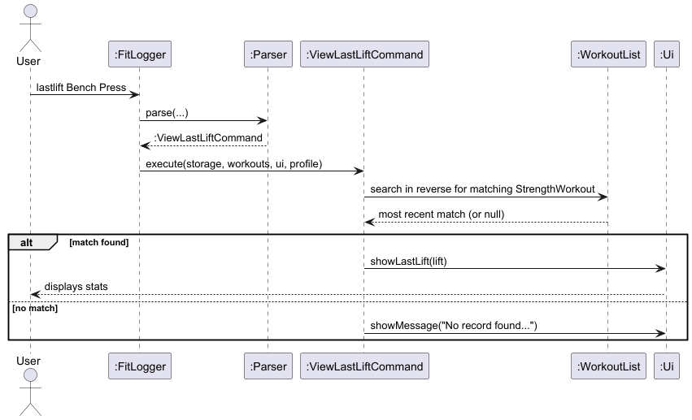

`ViewLastLiftCommand.execute(...)` performs the following steps:

1. Assert that `workouts` and `exerciseId` are not null.
2. Check that `exerciseId` is not blank — show usage hint if so.
3. Loop from `workouts.getSize() - 1` down to `0`.
4. For each entry, check if it is an `instanceof StrengthWorkout` and if its
   description matches `exerciseId` (case-insensitive).
5. On first match, call `ui.showLastLift(lift)` and return immediately.
6. If no match is found after the full loop, call `ui.showMessage("No record found...")`.

#### Design considerations

**Aspect: Search direction**
- **Current choice: reverse order** — searching from the end of the list finds
  the most recent entry first without scanning the entire list unnecessarily.
- **Alternative: forward order with tracking** — scan all entries and keep
  updating a reference to the latest match. Finds the same result but always
  scans the entire list.

**Aspect: Match criteria**
- **Current choice: case-insensitive description match** — simple and consistent
  with how exercise names are displayed and typed by users.
- **Alternative: match by numeric shortcut ID** — faster lookup but requires
  the user to remember IDs, which is less intuitive for a retrieval command.

---

### Enhancement 12: `ViewPrCommand`

#### Purpose and user value
`ViewPrCommand` finds and displays a user's personal record for a specific
exercise — the highest weight ever lifted for a strength exercise, or the
longest distance run for a run exercise. This gives users a motivational
milestone to track their progress against over time.

Command format:
```
pr <EXERCISE_NAME>
```

Example: `pr Bench Press`

#### Class-level design

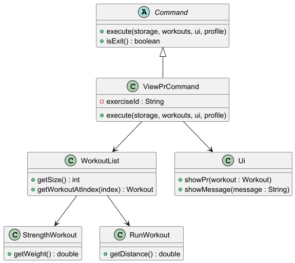

`ViewPrCommand` extends the abstract `Command` base class. Like
`ViewLastLiftCommand`, it holds only `exerciseId` as state and is a pure
read operation. It differs in that it scans the **entire** list rather than
stopping at the first match, in order to find the maximum value.

#### Sequence of events

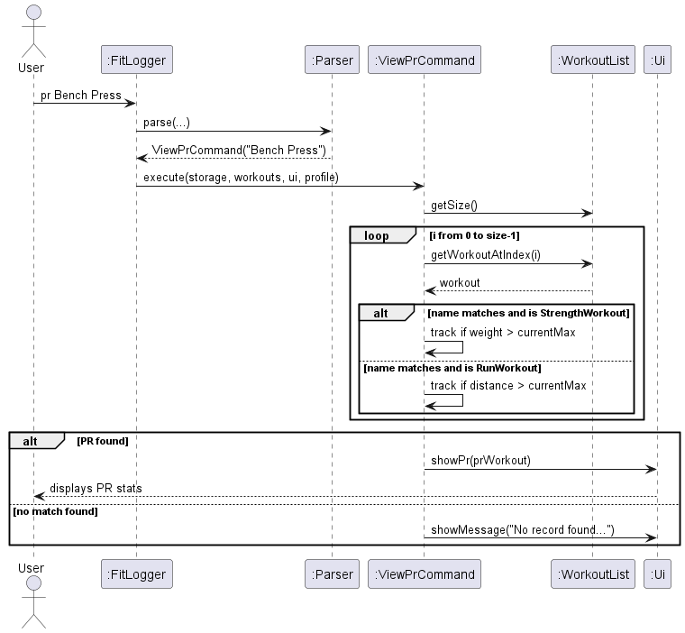

`ViewPrCommand.execute(...)` performs the following steps:

1. Assert that `workouts` and `exerciseId` are not null.
2. Check that `exerciseId` is not blank — show usage hint if so.
3. Initialise `prWorkout = null` and `maxValue = 0.0`.
4. Loop through all entries from index `0` to `workouts.getSize() - 1`.
5. For each entry whose description matches `exerciseId` (case-insensitive):
    - If it is a `StrengthWorkout` and `getWeight() > maxValue`, update `prWorkout`
      and `maxValue`.
    - If it is a `RunWorkout` and `getDistance() > maxValue`, update `prWorkout`
      and `maxValue`.
6. If `prWorkout != null`, call `ui.showPr(prWorkout)`.
7. Otherwise call `ui.showMessage("No record found...")`.

#### Design considerations

**Aspect: How to find the PR**
- **Current choice: linear scan of WorkoutList**
    - Pros: Simple, no extra data structures needed. `WorkoutList` is not
      expected to grow large enough to require optimisation.
    - Cons: O(n) per query.
- **Alternative: maintain a separate PR map** — a `HashMap<String, Double>`
  updated on every `add-lift` or `add-run`.
    - Pros: O(1) lookup.
    - Cons: Extra state to maintain and persist. Adds complexity for minimal
      gain at current scale.

**Aspect: PR metric per workout type**
- Strength workouts use **weight** as the PR metric.
- Run workouts use **distance** as the PR metric.
- This decision keeps the PR definition intuitive — heavier lift = better PR
  for strength; longer run = better PR for endurance.


### Enhancement 13: ViewCalendarCommand and ASCII Calendar Generation

#### Purpose and user value
The `ViewCalendarCommand` provides a visual "at-a-glance" view of a user's training consistency. By rendering a traditional monthly grid in the terminal, users can quickly identify gaps in their training and visualize their workout "streaks" without scanning a long text history.

Command format:
```
view-calendar <YYYY-MM>
```

Example: `view-calendar 2026-04`

#### Design overview
This enhancement utilizes the java.time API to handle calendar logic and follows the standard FitLogger command pipeline:

1. `Parser.parse(...)` routes the command to `Parser.parseViewCalendar(...)`.
2. `YearMonth` is used as the primary data structure to represent the target month.
3. `ViewCalendarCommand` extracts the "active days" from the `WorkoutList`.
4. `Ui.showCalendar(...)` performs the complex ASCII grid rendering.

#### Component-level behavior

1. Data Collection (`ViewCalendarCommand#execute`)
The command performs a linear scan of the `WorkoutList`. It uses a `HashSet<Integer>` to store the `dayOfMonth` for every workout that matches the `targetMonth`.
    - Decision: A `Set` is used to ensure that multiple workouts on the same day do not cause duplicate highlighting or logic errors during rendering.

2. Grid Rendering (`Ui#showCalendar`)
The rendering logic in Ui is the most complex part of this enhancement:
- It determines the **start day** of the month using `firstOfMonth.getDayOfWeek().getValue() % 7` to align Sunday to the first column.
- It calculates the **number of days** in the month using `yearMonth.lengthOfMonth()`.
- It uses a single loop from 1 to `daysInMonth`, using padding spaces for the first week and line breaks every Saturday.
- **Highlighting**: For each day, it checks `if (activeDays.contains(day))`. If true, it wraps the day in `[ ]` brackets; otherwise, it pads it with spaces to maintain column alignment.

#### Design considerations

Aspect: Calendar Alignment
- Current choice: Fixed-width `String.format("%2d")`: Ensures that single-digit days (1-9) and double-digit days (10-31) occupy the same horizontal space, preventing the grid from "shifting" and becoming unreadable.
- Alternative: Simple tab characters `\t`: Rejected because terminal tab widths vary across different operating systems (Windows vs. Linux), which would break the ASCII alignment.

#### Aspect: Date Library

- Current choice: `java.time.YearMonth`: Perfectly encapsulates the requirement (Month + Year). It simplifies leap year handling and day-of-week calculations compared to the older `java.util.Calendar` API.

---

### Enhancement 14: Muscle Group Tagging System (`ExerciseDictionary` muscle methods, `TagMuscleCommand`, `UntagMuscleCommand`, `LiftMuscleGroupsCommand`, `ViewMuscleGroupCommand`, and `TrainMuscleCommand`)

#### Purpose and user value

The muscle group tagging system extends the exercise shortcut database to support muscle group metadata. Users can tag lift shortcuts with one or more muscle groups, then use that metadata to plan workouts (`train`), inspect exercises (`muscle-groups`), and filter history (`filter`).

The system has five parts:

- `TagMuscleCommand`: adds a muscle group tag to a lift shortcut.
- `UntagMuscleCommand`: removes a muscle group tag from a lift shortcut.
- `LiftMuscleGroupsCommand`: displays all muscle groups tagged to a specific lift shortcut.
- `ViewMuscleGroupCommand`: displays all valid muscle groups available in the app.
- `TrainMuscleCommand`: lists all lift shortcuts tagged with a given muscle group.

The four default lift shortcuts ship with pre-loaded muscle group tags (e.g. Bench Press is pre-tagged with `pecs`, `triceps`, and `delts`). Tags added or removed by the user are persisted to the save file.

---

#### Class-level design

**Class Diagram: Muscle Tagging Command Hierarchy**
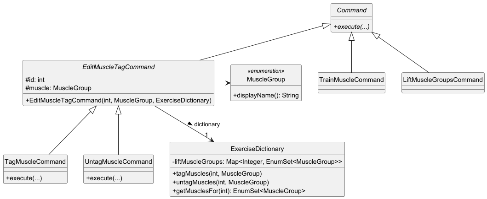

`ExerciseDictionary` is the shared data model for this system. It holds muscle group data in a `Map<Integer, EnumSet<MuscleGroup>>` field called `liftMuscleGroups`, keyed by lift shortcut ID. `MuscleGroup` is an enum with 14 values representing distinct muscle groups, each with a `displayName()` method that returns a lowercase, space-separated string for UI output.

`TagMuscleCommand` and `UntagMuscleCommand` both extend the abstract `EditMuscleTagCommand`, which stores the shared fields `id`, `muscle`, and `dictionary`. This intermediate layer avoids duplicating constructor logic across the two commands while keeping each command's `execute(...)` method focused on a single operation.

`LiftMuscleGroupsCommand`, `ViewMuscleGroupCommand`, and `TrainMuscleCommand` extend `Command` directly, as they have no shared state with the tag editing commands.

---

#### Object-level design (Memory Snapshot)

The system stores metadata in a `Map<Integer, EnumSet<MuscleGroup>>` within the `ExerciseDictionary`.

**Object Diagram: ExerciseDictionary Memory Snapshot (After adding tags to IDs 1 and 2)**
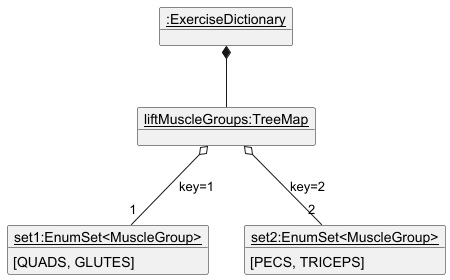
- **Technical Rationale**: An `EnumSet` is used instead of a `HashSet`
because it is represented internally as a bit-vector. 
This results in $O(1)$ lookup time and a significantly smaller memory footprint, which is ideal for a high-performance CLI application.

---

#### Component-level behavior

**`ExerciseDictionary` — muscle group methods**

- `tagMuscles(int id, MuscleGroup muscleGroup)`: calls `putIfAbsent` to initialise an `EnumSet` for the ID if one does not exist, then adds the muscle group.
- `untagMuscles(int id, MuscleGroup muscleGroup)`: retrieves the set for the ID and removes the muscle group. If no set exists, returns silently.
- `getMusclesFor(int id)`: returns the `EnumSet` for the ID, or an empty `EnumSet` if none exists.

`EnumSet` was chosen over `HashSet` because all elements are of a known enum type, making iteration ordered and memory usage compact.

**`TagMuscleCommand.execute(...)`**

1. Call `dictionary.tagMuscles(id, muscle)`.
2. Display confirmation: `Added <muscle.displayName()> to lift <id>`.
3. Shows `<muscle.displayName()> is already tagged to lift <id>` if muscle is already tagged.

**Sequence Diagram: Execution of a `tag-muscle` Command (Scenario: Tagging ID 1 with 'quads')** 
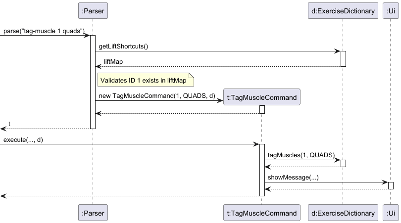

**`UntagMuscleCommand.execute(...)`**

1. Call `dictionary.untagMuscles(id, muscle)`.
2. Display confirmation: `Removed <muscle.displayName()> from lift ID: <id>`.
3. Shows `<muscle.displayName()> was not found on lift ID: <id>` if muscle tag does not exist.

**`LiftMuscleGroupsCommand.execute(...)`**

1. Retrieve the exercise name via `dictionary.getLiftName(id)`.
2. Retrieve the muscle group set via `dictionary.getMusclesFor(id)`.
3. If the set is empty, display `No muscle groups tagged for <name> (ID: <id>).`
4. Otherwise display `Muscle groups for <name>: <set>`.

**`ViewMuscleGroupCommand.execute(...)`**

1. Delegates entirely to `ui.showMuscleGroups()`, which iterates over `MuscleGroup.values()` and prints each `displayName()`.

**`TrainMuscleCommand.execute(...)`**

1. Display a header: `Exercises targeting: <targetMuscle.displayName()>`.
2. Iterate over all entries in `dictionary.getLiftShortcuts()`.
3. For each entry, call `dictionary.getMusclesFor(entry.getKey())` and check if it `.contains(targetMuscle)`.
4. If so, print `[<id>] -> <name>` and set `exerciseFound = true`.
5. If no exercises were found after the full loop, display a no-results message and prompt the user to use `tag-muscle`.

---

#### Parser-level behavior

**`parseTagMuscle(arguments, dictionary, isTag)`** handles both `tag-muscle` and `untag-muscle` via a shared method, with the `isTag` boolean determining which command is returned:

1. Split arguments into two parts: shortcut ID and muscle group name.
2. Parse the ID as an integer; throw `FitLoggerException` if not numeric.
3. Verify the ID exists in `dictionary.getLiftShortcuts()`; throw if not found.
4. Normalise the muscle group string with `.toUpperCase().replace(' ', '_')` and validate via `MuscleGroup.isValid(...)`.
5. Return either `new TagMuscleCommand(...)` or `new UntagMuscleCommand(...)`.

**`parseLiftMuscleGroup(arguments, dictionary)`** handles `muscle-groups`:

1. Parse the argument as a positive integer shortcut ID.
2. Verify the ID exists in `dictionary.getLiftShortcuts()`.
3. Return `new LiftMuscleGroupsCommand(id, dictionary)`.

**`parseTrainMuscle(arguments, dictionary)`** handles `train`:

1. Normalise the muscle group string and validate via `MuscleGroup.isValid(...)`.
2. Return `new TrainMuscleCommand(MuscleGroup.valueOf(muscleGroup), dictionary)`.

Note that multi-word muscle groups (e.g. `upper back`) are supported by normalising spaces to underscores before enum lookup, so the user does not need to type `UPPER_BACK` themselves.

---

#### Persistence of muscle group tags

Muscle group tags are saved and loaded as part of the shortcut row format in `data/fitlogger.txt`. When `Storage.saveData(...)` writes lift shortcuts, it calls `generateLiftString(id, name)`, which appends a fifth pipe-separated field containing a comma-separated list of muscle group display names if any tags exist:

```
S | lift | 2 | Bench Press | pecs,triceps,delts
```

During `loadData(...)`, the `parseShortcut(fields)` method checks for the presence of this fifth field. If found, it splits on commas, normalises each entry to `UPPER_CASE_WITH_UNDERSCORES`, validates via `MuscleGroup.isValid(...)`, and calls `dictionary.tagMuscles(id, MuscleGroup.valueOf(...))` for each valid entry. Invalid or unrecognised muscle group strings are silently skipped.

This means custom tagging (both user-added and default tags modified at runtime) persists across sessions without any separate storage mechanism.

---

#### Validation and error handling

|Input error|Error message shown|
|---|---|
|Missing arguments for `tag-muscle` / `untag-muscle`|`Missing arguments.` + usage hint|
|Fewer than 2 parts|`Invalid format.` + usage hint|
|Non-numeric shortcut ID|`Input a valid shortcut ID.`|
|ID not found in dictionary|`Shortcut does not exist in database.` + `view-database` hint|
|Invalid muscle group name|`Muscle group does not exist in database.` + `view-muscle-groups` hint|
|Missing argument for `train`|`Missing muscle group.` + usage hint|
|Missing argument for `muscle-groups`|`Missing arguments.` + usage hint|
|Non-numeric ID for `muscle-groups`|`Input a valid shortcut ID.`|

---

#### Design considerations

**Aspect: Storage structure for muscle group metadata**

- **Current choice: fifth pipe-separated field on the shortcut row** — reuses the existing `S | lift | <id> | <name>` row format by appending `| <muscle1>,<muscle2>`. No new row type is needed, and the field is optional, so rows without tags load correctly without any format migration.
- **Alternative: separate row type (e.g. `M | <id> | <muscle>`)** — one row per tag, making individual tags easy to add or remove in the file. Rejected because it multiplies the number of rows for heavily tagged exercises and complicates the load order, since the shortcut row would need to appear before any of its tag rows.

**Aspect: Shared abstract class for `TagMuscleCommand` and `UntagMuscleCommand`**

- **Current choice: `EditMuscleTagCommand` as an intermediate abstract class** — stores `id`, `muscle`, and `dictionary` once, avoiding constructor duplication. Each subclass only implements `execute(...)`.
- **Alternative: no intermediate class, duplicate fields in each command** — simpler hierarchy but violates DRY. Any future change to the shared constructor (e.g. adding validation) would need to be made in two places.

**Aspect: Enum vs. string for muscle groups**

- **Current choice: `MuscleGroup` enum** — provides compile-time safety, a fixed set of valid values, and a clean `displayName()` method for UI output. `MuscleGroup.isValid(String)` gives the parser a single source of truth for validation.
- **Alternative: plain strings stored in a set** — more flexible but allows arbitrary typos to enter the system. Rejected because the set of muscle groups is fixed and well-known, making an enum the more appropriate structure.

---

### Enhancement 15: `HistoryCommand` 

#### Purpose and user value

The `history` command provides a chronological view of all logged workouts. With the v2.1 update, users can now specify an optional numeric limit (e.g., `history 5`) to quickly view only the most recent entries, reducing terminal clutter for power users with extensive training logs.

#### Command format

`history [NUMBER]`
- `[NUMBER]`: Optional positive integer.
- If omitted, the command displays the entire workout list.


#### Design overview

The `HistoryCommand` is a read-only operation that iterates through the `WorkoutList`.
1. `Parser.parse(...)` detects the `history` keyword.
2. If an argument exists, it is parsed via `parsePositiveIntegerWithinLimit`. If no argument is found, a sentinel value of `-1` is stored in the command.
3. During execution, the command determines the starting index: `Math.max(0, workouts.getSize() - limit)`.


#### UML Diagrams

**Sequence Diagram: Execution of `history 3`**
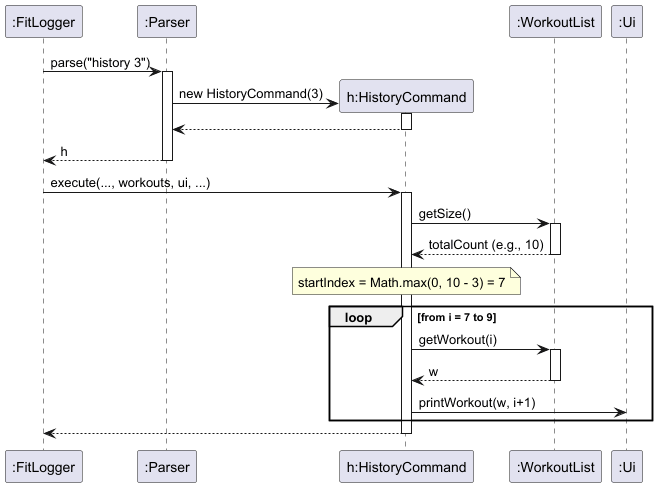

#### Component-level behavior

`HistoryCommand.execute(...)` performs the following steps:
1. **Bounds Check**: If the requested number is larger than the total workouts, it defaults to showing the entire list.
2. **Polymorphic Printing**: It iterates from the calculated starting index to the end of the list, calling `ui.printWorkout(workout, index)` for each entry. This ensures that the global index of the workout is preserved in the display, even when showing a partial list.


#### Design considerations

**Aspect: Processing Logic**

- **Current Choice: Calculating start-index in the Command.** * **Pros:** Minimizes memory usage as it only iterates over the required slice of the list.
    - **Alternative:** Retrieving the whole list and filtering in the UI.
    - **Reason for Rejection:** Less efficient for very large logs; the Command should be responsible for data slicing logic.

---

### Command Architecture

The execution logic of **FitLogger** is centered around the **Command Pattern**. This architectural 
choice decouples the object that invokes an operation (the main execution loop in `FitLogger`) from the 
objects that actually perform the action.

#### Design Rationale
By encapsulating a request as an object, the system achieves several key design goals:
* **Separation of Concerns:** The `FitLogger` main class does not need to know the 
internal logic of specific features; it only needs to call a uniform `execute()` method.
* **Extensibility:** Adding new features (e.g., `edit-run`) only requires creating a new 
subclass of `Command` and updating the `Parser`, leaving the core execution loop untouched.
* **Uniform Error Handling:** Since all commands follow the same interface, exceptions thrown 
during execution (like `FitLoggerException`) can be caught and handled globally by the main loop.

#### Components and Interaction
The Command architecture consists of three primary elements:
1.  **`Command` (Abstract Class):** The base template for all actions. It defines the `execute(Storage, WorkoutList, Ui, UserProfile)` method, ensuring every command has access to the necessary system components.
2.  **Concrete Implementations:** Subclasses like `AddWorkoutCommand` and `DeleteCommand` store specific user-inputted states—such as a `Workout` object or an index `String`—internally until execution.
3.  **Polymorphic Execution:** The `FitLogger#run()` method maintains a "Parse-then-Execute" loop. It treats all returned objects as the abstract `Command` type, invoking `isExit()` to determine if the application should terminate.

Unlike "ready-to-run" implementations, FitLogger's commands are **stateless regarding the system** 
but **stateful regarding user input**. They are instantiated with arguments by the `Parser` but only gain 
access to application data (`WorkoutList`) and persistence (`Storage`) at the moment of execution.

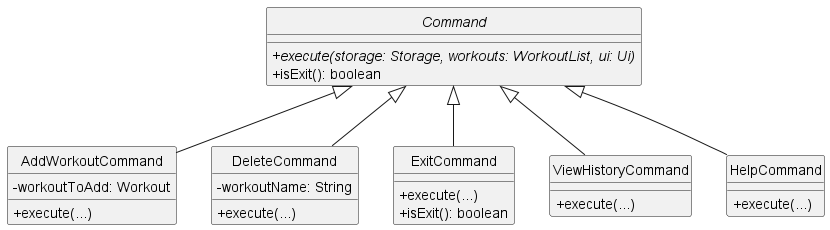

---

### Parser Implementation

The `Parser` component is a static utility class responsible for transforming raw user input strings into the 
executable `Command` objects described above.

#### Execution Logic
The parsing logic is centralized in the `Parser#parse()` method, following a two-stage process:
1.  **Tokenization:** The input string is split into a `commandWord` and `arguments` using the `splitInput` 
helper method.
2.  **Command Dispatch:** A `switch` block routes the `commandWord` to the appropriate command constructor 
  (e.g., `DeleteCommand`, `ExitCommand`) or specialized sub-parser methods (e.g., `parseAddRun`, `parseAddLift`).

The parser follows the same `parse-then-execute` flow used by the command features described above.

---

### Design Considerations

**Aspect: Class Structure**
* **Current Implementation:** Static utility class.
    * **Pros:** Simple to use across the application without maintaining state; lightweight for the current scope.
    * **Cons:** Harder to "mock" during unit testing compared to an instance-based approach.
* **Alternative Considered:** Instance-based Parser with Dependency Injection.
    * **Reason for Rejection:** Given the current requirements of FitLogger, a static parser is sufficient 
  and avoids unnecessary complexity.

**Aspect: Data Validation**
* The parser acts as a gatekeeper for data integrity. It ensures that user-inputted text (like workout names) 
does not contain reserved characters (`|` or `/`) used by the `Storage` component. This prevents potential 
file corruption during save/load operations.

## Product scope
### Target user profile

A student or hybrid athlete who prefers desktop CLI applications over mobile GUI apps. They are comfortable typing fast, value keyboard-centric workflows, and want a unified platform to track both strength training (lifts) and cardiovascular training (runs) without navigating through complex menus.

### Value proposition

FitLogger provides a blazingly fast, distraction-free environment to log mixed-modality workouts. It solves the friction of traditional fitness apps by allowing users to log complex workouts (like a 5-set bench press or a 10km tempo run) in a single line of text, complete with a customizable shortcut database to speed up daily data entry.

## User Stories

|Version| As a ... | I want to ... | So that I can ...|
|--------|----------|---------------|------------------|
|v1.0|new user|see usage instructions|refer to them when I forget how to use the application|
|v1.0|user|delete an unwanted workout by index|remove duplicate or accidental entries from my history|
|v1.0|user|exit the application safely|save my workouts before the program closes|
|v2.0|user|edit a wrongly entered workout field|correct logging mistakes without deleting and recreating the workout|
|v2.0|user|search workouts by date|review what I trained on a specific day|
|v2.0|user|receive clear errors for malformed commands|understand what went wrong and how to correct my input|

## Non-Functional Requirements

1. **Compatibility:** The system should work seamlessly on any mainstream operating system (Windows, Linux, macOS) that has Java 17 or above installed.
2. **Performance:** The system should respond to user commands (parsing, execution, and UI feedback) within 100 milliseconds to maintain a snappy CLI experience.
3. **Robustness:** The application should handle corrupted or manually modified save files (`data/fitlogger.txt`) gracefully by skipping malformed lines without crashing, ensuring valid historical data is still loaded.
4. **Data Portability:** The persistence mechanism must use a human-readable text format, allowing users to easily back up, read, or migrate their data without specialized software.

## Glossary

* **Command** - A user instruction entered into the CLI, such as `edit 1 distance/5`,
`delete 2`, `search-date 2026-03-15`, or `exit`.
* **Workout** - A logged exercise entry. In FitLogger, a workout is either a run workout
or a strength workout.
* **Run workout** - A workout that records a run name, date, distance in kilometres, and
duration in minutes.
* **Strength workout** - A workout that records a lift name, date, weight in kilograms,
number of sets, and number of repetitions.
* **Workout index** - The one-based number shown beside each workout in `history`.
Users use this number when editing or deleting workouts.
* **One-based index** - An index that starts from `1` for the first item shown to the user.
FitLogger uses one-based indexes in user commands.
* **Zero-based index** - An index that starts from `0`. FitLogger converts user-facing
one-based indexes into zero-based indexes internally when accessing `WorkoutList`.
* **Shortcut ID** - A positive integer that represents a run or lift in the exercise
dictionary. For example, a user can enter a shortcut ID instead of typing the full
exercise name.
* **Exercise dictionary** - The shared database of known run and lift names, including
default entries and user-added shortcuts.
* **Workout name** - The user-facing name of a workout. Internally, this is stored in the
`description` field of `Workout`, but the User Guide and edit command call it `name`.
* **Reserved storage character** - A character that has special meaning in
`data/fitlogger.txt`. FitLogger rejects `|` and `/` in workout names to prevent corrupted
save-file entries.
* **Plain decimal notation** - A normal decimal number such as `80`, `80.5`, or `5.0`.
FitLogger rejects scientific notation, `NaN`, and `Infinity` for workout decimal fields.
* **Save file** - The local `data/fitlogger.txt` file used to store workouts, profile data,
and custom shortcuts between app sessions.
* **Command-level log** - Diagnostic information written through Java's `Logger` API to
`logs/fitlogger.log`, rather than printed as normal CLI output.

## Instructions for manual testing

These instructions assume the tester has launched FitLogger using `java -jar fitlogger.jar`.
Start with a clean or disposable save file when testing destructive commands such as `delete`.

### Preparing sample data

1. Enter `add-run Easy Run d/3 t/30`.
   Expected:
   `Got it. I've added this workout:`
   followed by `[Run] Easy Run (Date: <date>) (Distance: 3.0km, Duration: 30.0 mins)`.

2. Enter `add-lift Bench Press w/80 s/3 r/8`.
   Expected:
   `Got it. I've added this workout:`
   followed by `[Lift] Bench Press (Date: <date>) (80.0kg, 3 sets of 8 reps)`.

3. Enter `history`.
   Expected: two workouts are shown in this order:
   1. `[Run] Easy Run ...`
   2. `[Lift] Bench Press ...`

### Testing `edit`

1. Test a valid run edit.
   - Command: `edit 1 distance/5`
   - Expected: `Updated workout 1: [Run] Easy Run (Date: <date>) (Distance: 5.0km, Duration: 30.0 mins)`

2. Test a valid lift edit.
   - Command: `edit 2 reps/10`
   - Expected: `Updated workout 2: [Lift] Bench Press (Date: <date>) (80.0kg, 3 sets of 10 reps)`

3. Test a field that is not valid for the workout type.
   - Command: `edit 1 weight/90`
   - Expected: `Field 'weight' is only valid for lift workouts.`

4. Test shorthand rejection.
   - Command: `edit 1 d/6`
   - Expected: `Unknown editable field: d`

5. Test invalid decimal notation.
   - Command: `edit 1 distance/8e1`
   - Expected: `Invalid distance value: 8e1`

6. Test integer bounds.
   - Command: `edit 2 sets/1000001`
   - Expected: `Sets must not exceed 1000000.`

### Testing `delete`

1. Test a valid delete.
   - Command: `delete 1`
   - Expected: `Deleted workout: Easy Run`

2. Enter `history`.
   - Expected: the old workout 2 is now shown as workout 1:
     `1. [Lift] Bench Press (Date: <date>) (80.0kg, 3 sets of 10 reps)`

3. Test a non-numeric index.
   - Command: `delete abc`
   - Expected: `[ERROR] Workout index must be a positive integer.`

4. Test extra arguments.
   - Command: `delete 1 2`
   - Expected:
     `[ERROR] Invalid format for delete.`
     followed by `Usage: delete <index>`.

5. Test an out-of-range index.
   - Command: `delete 99`
   - Expected: FitLogger reports `Invalid workout index: 99`.

### Testing `search-date`

1. Add a workout if the sample data has been deleted.
   - Command: `add-run Tempo Run d/5 t/40`
   - Expected:
     `Got it. I've added this workout:`
     followed by `[Run] Tempo Run (Date: <date>) (Distance: 5.0km, Duration: 40.0 mins)`.

2. Search for the date shown in the newly added workout.
   - Command: `search-date YYYY-MM-DD`, replacing `YYYY-MM-DD` with the displayed workout date.
   - Expected:
     `Workouts on YYYY-MM-DD:`
     followed by workouts logged on that date only.

3. Test a valid date with no matching workouts.
   - Command: `search-date 1900-01-01`
   - Expected: `No workouts found.`

4. Test invalid date format.
   - Command: `search-date 2026/03/15`
   - Expected:
     `[ERROR] Invalid date format for search-date.`
     followed by `Usage: search-date <YYYY-MM-DD>`.

5. Test extra arguments.
   - Command: `search-date 2026-03-15 extra`
   - Expected:
     `[ERROR] Invalid format for search-date.`
     followed by `Usage: search-date <YYYY-MM-DD>`.

### Testing `exit`

1. Test extra argument rejection.
   - Command: `exit now`
   - Expected:
     `[ERROR] Invalid format for exit.`
     followed by `Usage: exit`. FitLogger remains running.

2. Test normal exit.
   - Command: `exit`
   - Expected:
     `Workouts saved.`
     followed by `Goodbye! See you at your next workout!`

3. Restart FitLogger.
   - Expected: previously saved workouts are loaded again, confirming that exit saved successfully.


#### Profile Management

**1. Setting and Viewing Profile**
- Test case: `profile set name John Doe` `profile set height 1.8` `profile set weight 80`
- Expected: Success messages for each field. Run `profile view` to confirm formatting (e.g., `1.80m`).
- Test case: `profile set height 5.0` (Out of bounds)
- Expected: Error message regarding unrealistic metrics.

**2. Clearing Profile**
- Test case: `profile clear`
- Expected: Confirmation message. `profile view` should now show "not set yet" for all fields.

#### Muscle Group Tagging

**1. Tagging and Filtering**
- Test case: `tag-muscle 1 quads` (Assuming ID 1 exists)
- Expected: Success message.
- Test case: `train quads`
- Expected: Shortcut ID 1 appears in the list.

#### History and Analytics

**1. Limited History**
- Prerequisites: Have at least 5 workouts logged.
- Test case: `history 2`
- Expected: Only the last 2 workouts are displayed, but they retain their original list indices.

**2. Shoe Mileage Windowing**
- Test case: `view-total-mileage 0`
- Expected: Displays total distance for workouts logged **today** only.